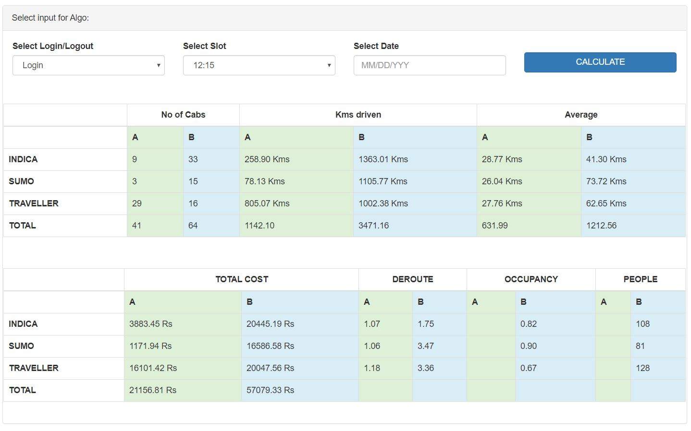

# Scheduling

A Python Data Science Project on Assigning Cabs to a Group of People (Pool), minimizing Distance and Travel Time.

## Theoretical Efficiency


## Overview
This project focuses on optimizing cab assignments for groups of people traveling to or from various locations. The goal is to cluster users into efficient "pools" to minimize overall travel distance and time. It utilizes distance matrix APIs, haversine calculations, and custom clustering logic to generate optimal schedules.

## Features
- **Distance Calculation**: Leverages both the Google Maps Distance Matrix API (`google distance.py`) and Haversine formulas (`h20.py`, `haversien matrix.py`) for accurate real-world and point-to-point distance metrics.
- **Clustering & Pooling**: Groups individuals based on their locations to maximize vehicle occupancy and minimize route deviations (`cluster.py`, `split_pools.py`).
- **Analysis & Visualization**: Tools to compare the theoretical efficiency of the generated routes against alternative or baseline methods (found in the `Analysis` directory).
- **Format Flexibility**: Consumes and processes various data formats like JSON (`dist_matrix.json`, `latlon.json`, `column.json`) and exports structured CSVs (`final_splits.csv`, `ordered_pools.csv`).

## Dependencies
The project relies on several key Python packages. Ensure they are installed before running the scripts:

```bash
pip install pandas googlemaps haversine pydash matplotlib
```

## Project Structure
- `google distance.py`: Script to interface with the Google Maps API to pull distance matrix data.
- `haversien matrix.py` & `h20.py`: Calculate "as the crow flies" distances using Haversine formulas.
- `cluster.py` & `split_pools.json`: Core logic for organizing individuals into vehicle pools.
- `Analysis/`: Directory containing Jupyter Notebooks (`.ipynb`) and scripts to analyze and compare scheduling efficiencies.
- `Dashboard/`: Contains visualizations of the scheduling performance.

## Usage
1. Provide the necessary location data in the expected JSON formats (`latlon.json`, `column.json`, `row.json`).
2. Run the distance calculation scripts (e.g., `calc_dist.py`, `google distance.py`) to generate the distance matrices.
3. Execute the clustering script (`cluster.py`) to group users into pools.
4. Review the final splits in the generated CSV output (e.g., `final_splits.csv`).
